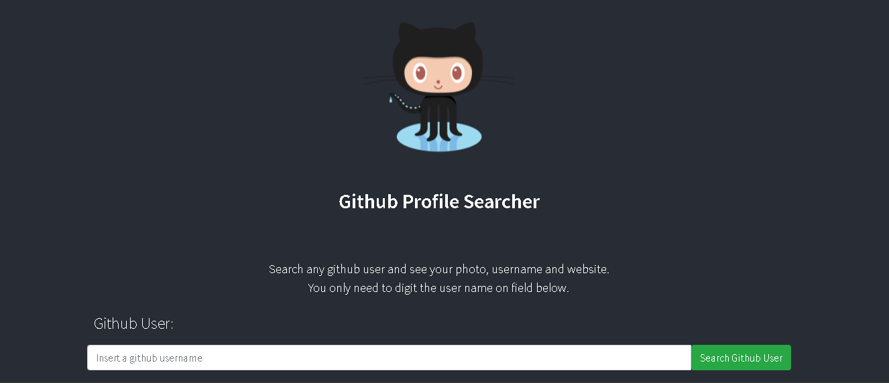
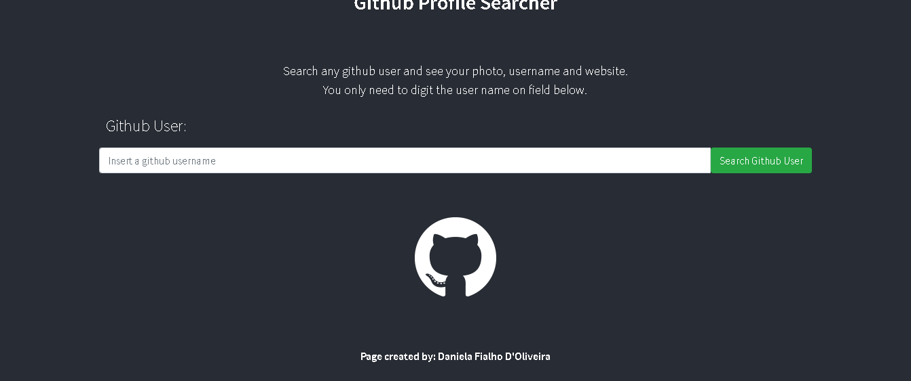
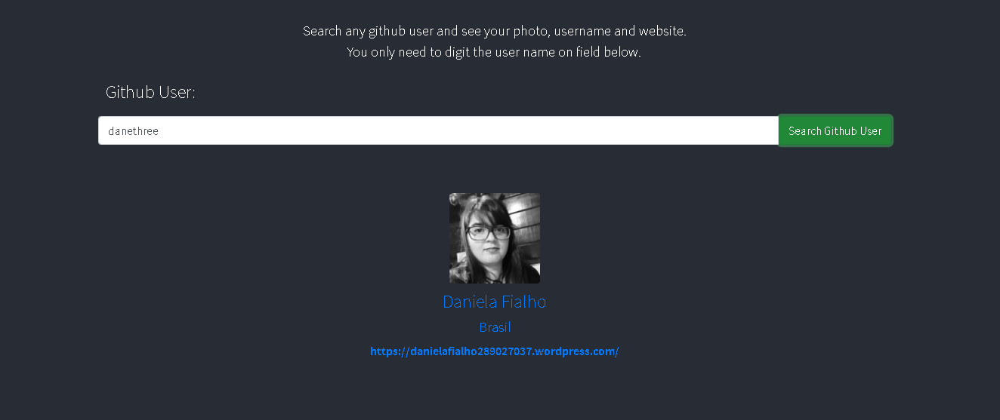

<h1>Github profile Searcher</h1>
 
         
 
 
 
 
  
   
 Fill the empty field with a github username:

 
  The Github API must return informations that contains the name, location and website of the user:

<h1> Running instructions</h1>

### `yarn start`

Runs the app in the development mode.\
Open [http://localhost:3000](http://localhost:3000) to view it in the browser.

The page will reload if you make edits.\
You will also see any lint errors in the console.

### `yarn test`

Launches the test runner in the interactive watch mode.\
See the section about [running tests](https://facebook.github.io/create-react-app/docs/running-tests) for more information.

